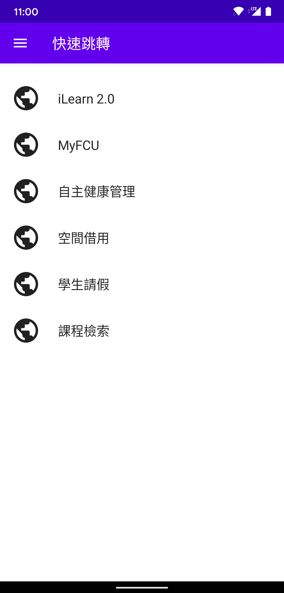
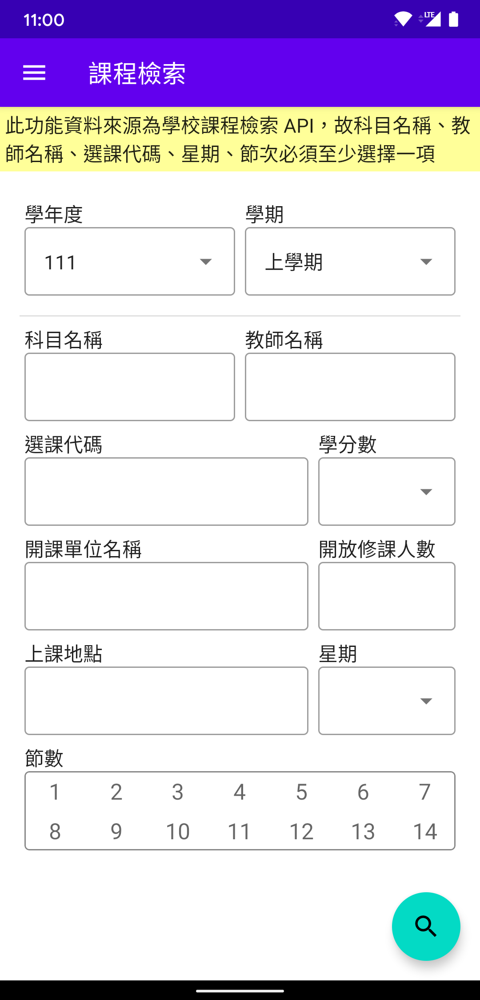
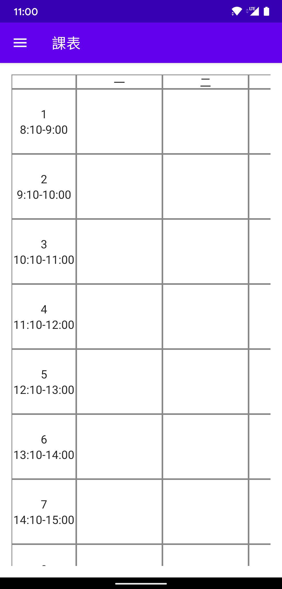
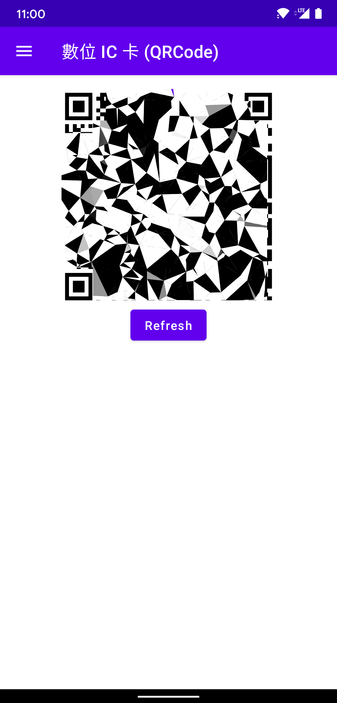

# Open FCU

比行動逢甲更好用的行動 APP  
捨棄難用的內嵌網頁，全部使用原生界面  
去除不常用功能，新增課程檢索等實用功能

歡迎許願、提 issue 或 PR  
也歡迎找我聊天（前提是遇得到我）

## Preview

  
  
  
  

## Feature Planning

### 0.1

- [x] 儲存帳號密碼
- [x] 網頁跳轉
  - [x] iLearn 2.0
  - [x] MyFCU
  - [x] 請假
  - [x] 空間借用
  - [x] 自主健康管理
  - [x] 課程檢索

### 0.2

- [ ] (擱置) 快速課堂簽到
- [ ] (擱置) 快速 PASS
- [x] 顯示 QRCode

暑假沒課讓我簽到，沒法模擬  
~~PASS 等開學再看情況決定是否實裝~~
看來學校執迷不悟，預計在 6.0 實裝

### 0.3

- [x] 課表
  - [ ] ~~日模式~~
  - [x] 周模式

日模式課表比較少用，移至 todolist

### 0.4

- [x] 課程查詢

使用學校課程檢索 API 查詢

### 0.5

- [x] 捷徑 (Shortcut)

按一下開啟 MyFCU 或 iLearn 2.0

### 1.0

- [ ] 完善 UI/UX
  - [ ] 帳號密碼已儲存提醒
  - [ ] 檢索防呆設計
  - [ ] 課程檢索結果的課程資訊重新排版

## Todolist

- 新的 icon
- 首頁
  - MyFCU 通知
  - 動態橫幅
- 自訂快速跳轉捷徑
- 快速簽到
- 點選檢索結果顯示課程詳細資訊
- 日模式課表
- 上課提醒

## Wishlist

- 將更多功能轉換成原生界面
- Desktop 支援
- iOS 支援 (哪天有人送我能跑 XCode 的電腦就會支援)

## Tech Stack

- Android SDK
- Jetpack Compose
- Kotlin/JVM
